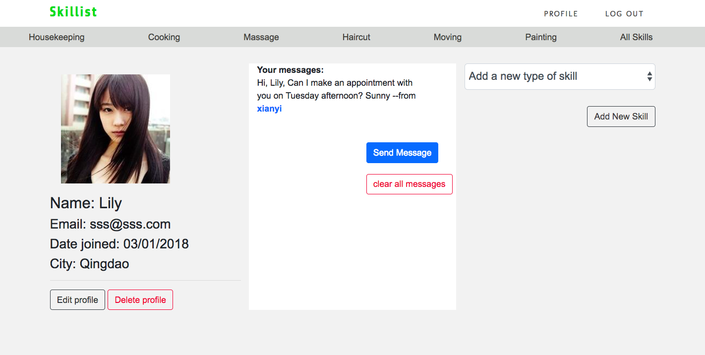

# SKILLIST

## Link to Heroku: https://skillist.herokuapp.com/

### Homepage 

### Category Showpage

### User profilepage

Welcome to Skillist! This is an app for the workers who wants to post their own skills and other users could find who has the skills they would like to pay by hourly.

### In the app, you are able to:
- Look for skills providers who you need
- Create your own profile 
- Create your skills
- Create a category if you could not find one fit you
- Write a message to your target service provider that you could keep in touch by messaging for making an appointment
- Edit you profile
- Edit and delete any skills that you have written
- Delete you profile (we'll be sad to see you go, though!)

## Built with
- Bootstrap 4.0
- Ruby 
- Rails 5.1.4
- PostgresQL 
- Paperclip/AWS
- JQuery

## Installation and setup steps:
- Install "postgres"
- Bundle install by run "bundle install" in your terminal
- Sarting rails server by run "rails server" in your terminal
- create database by run "rails db:create" in your terminal
- migrate data by run "rails db:migrate" in your terminal
- seed data by run "rails db:seed" in your terminal

## User Stories: https://trello.com/b/72pcKo9P/skillist

### ERD and FRAMWORK

### List of unsolved problems or future features
- Action Cable to enable users to chat
- OAuth by third party login
- ActionMailer
- payment feature to enable users make a transaction online